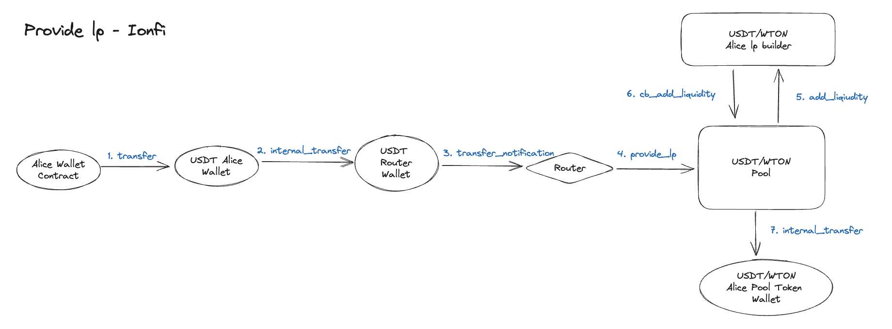

# Add Liquidity

<figure><figcaption></figcaption></figure>

Alice wants to provide liquidity to a USDT/WTON pool. When Alice sends USDT and WTON to the Router, liquidity is added and Pool Tokens are issued and delivered to Alice.

1. Alice Wallet sends a `transfer` message to Alice's USDT Wallet.
   1. The recipient is the Router, and the message contains details of the liquidity provision.
2. An `internal_transfer` message is sent from Alice's USDT Wallet to the Router's USDT Wallet.
3. A `transfer_notification` message is sent from the Router's USDT Wallet to the Router.
4. A `provide_lp` message is sent from the Router to the Pool. This message contains details about which tokens were received, their amount, and the sender.
5. An `add_liquidity` message is sent from the Pool to Alice's LPBuilder.
   1. An LPBuilder is created for each Account and Pool combination.
6. If Alice has both USDT and WTON, a `cb_add_liquidity` message is sent from Alice's USDT/WTON LPBuilder to the Pool.
   1. The message flow ends after the first transaction.
   2. The `cb_add_liquidity` message is sent in the last token transfer transaction.
7. Upon receiving the `cb_add_liquidity` message, the Pool sends an `internal_transfer` message to Alice's Pool Token Wallet and mints the Pool Token
