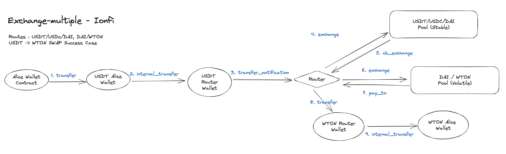
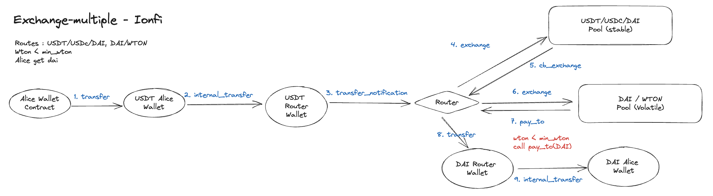

# Cross Pool Exchange

<figure><figcaption></figcaption></figure>

There's a USDT/USDC/DAI pool and a DAI/WTON pool, and Alice wants to exchange USDT for WTON. Alice needs to cross two pools for this exchange. She sends USDT to the Router, and the Router sends WTON back to her.

1. Alice's Wallet sends a `transfer` message to Alice's USDT Wallet.
   1. The Router is the recipient, and the message contains swap details such as the pool used and minimum amount.
2. An `internal_transfer` message is sent from Alice's USDT Wallet to the Router's USDT Wallet.
3. A `transfer_notification` message is sent from the Router's USDT Wallet to the Router.
4. An `exchange` message is sent from the Router to the USDT Pool.
5. A `cb_exchange` message is sent from the USDT Pool to the Router.
6. Another exchange message is sent from the Router to the DAI Pool.
7. The DAI Pool contract sends a `pay_to` message to the Router.
   1. This message includes the type and amount of coins that should be sent to Alice.
8. The Router contract sends a `transfer` message to the Router's WTON Wallet.
9. A `transfer` message is sent from the Router's Wallet to Alice's Wallet.
   1. Alice receives WTON at this point.

The minimum exchange amounts are required as an argument for each exchange. The process will be stopped if this minimum requirements aren't met. In that case, the process will be stopped in the middle of crossing a pool, and the user will receive an intermediate result. In below diagram, during the USDT → WTON exchange, user may end up receiving DAI instead.

<figure><figcaption></figcaption></figure>

