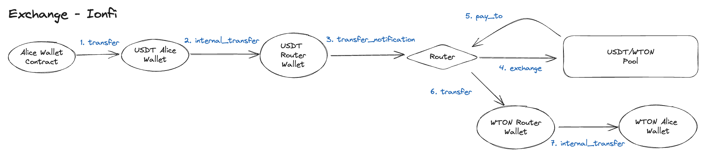

# Exchange

<figure><figcaption></figcaption></figure>

Alice wants to swap WTON for USDT in the USDT/WTON pool. Alice sends USDT to the Router, and in return, the Router sends WTON to Alice.

1. Alice's Wallet sends a transfer message to Alice's USDT Wallet.
   1. The Router is the recipient, and the message contains swap details such as the pool used and minimum amount.
2. An `internal_transfer` message is sent from Alice's USDT Wallet to the Router's USDT Wallet.
3. A `transfer_notification` message is sent from the Router's USDT Wallet to the Router.
4. An `exchange` message is sent from the Router to the Pool.
5. The Pool contract sends a `pay_to` message to the Router.
   1. This message includes the type and amount of coins that should be sent to Alice.
   2. If Alice's WTON amount is less than the minimum, a message is generated to send USDT back to her.
6. The Router contract sends a `transfer` message to the Router's WTON Wallet.
7. A `transfer` message is sent from the Router's Wallet to Alice's Wallet.
   1. Alice receives WTON.
