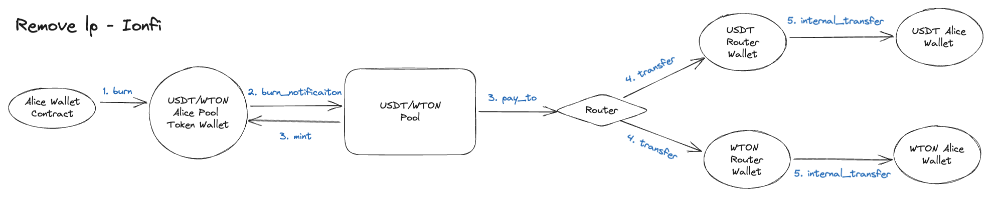

# Remove Liquidity

<figure><figcaption></figcaption></figure>

Alice wants to remove liquidity from the USDT/WTON pool. When she burns her Pool Tokens, the Router sends her USDT and WTON in return.

1. Alice's Wallet sends a `burn` message to Alice's Pool Token Wallet.
2. Alice's Pool Token Wallet sends a `burn_notification` message to the Pool.
   1. For a Stable Pool, if the burn amount is less than the amount calculated based on the coins Alice wishes to receive, a message to mint the remaining number of Pool Tokens is sent to the Pool Token Wallet.
3. The Pool contract sends a `pay_to` message to the Router.
   1. This message includes the type and amount of coins that should be sent to Alice.
4. The Router contract sends a `transfer` message to the Router's Wallet for each coin type.
5. A `transfer` message is sent from the Router's Wallet to Alice's Wallet.
   1. Alice receives USDT and WTON.
