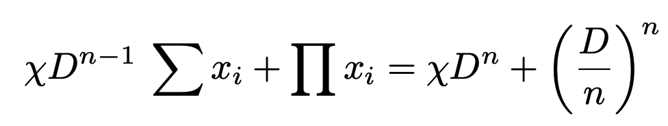
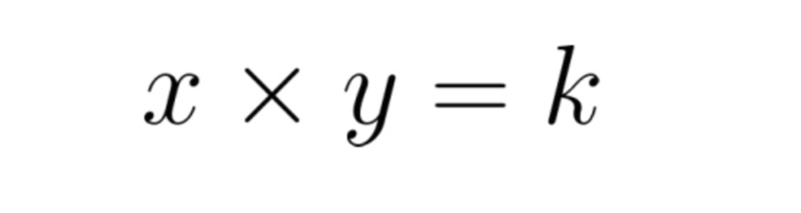

# Architecture

The architecture of ION Finance V1 is as follows

### **Router**

The Router is the main contract in Ion Finance, where the majority of transactions begin. It holds all tokens offered as liquidity. Functions it supports include adding liquidity, exchanging tokens, creating pools, and adjusting parameters like pool fees.

### **Pool**

The Pool contract keeps track of each token's liquidity and acts as a Jetton Minter for the LP token, called the Pool Token.

#### **Stable Pool**

A Stable Pool aims to minimize slippage when the tokens within the pool have similar prices. Such a pool can be composed of 2 or 3 tokens, such as stablecoins like USDT and USDC or closely related coins like BTC and wBTC, to optimize efficiency.

This invariant is used when trading two tokens with stable prices to minimize slippage. To solve the invariant, ION Finance uses Newton's method.

<figure><figcaption></figcaption></figure>

#### **Volatile Pool**

A Volatile Pool is meant for tokens that have differing prices. An example would be a pool containing USDT and TON tokens. This type of pool can only contain 2 different tokens.

This invariant is used when trading two tokens with high price volatility.

<figure><figcaption></figcaption></figure>

### **Pool Token Wallet**

The Pool Token Wallet is the wallet contract for the Pool Token. Pool contract is the Jetton Minter.

### **LP Builder**

In the EVM, you can transfer multiple tokens in a single transaction. But, due to TVM's parallel processing characteristics, this isn't possible. When providing liquidity, LPBuilder contract stores the token amounts provided temporarily.
