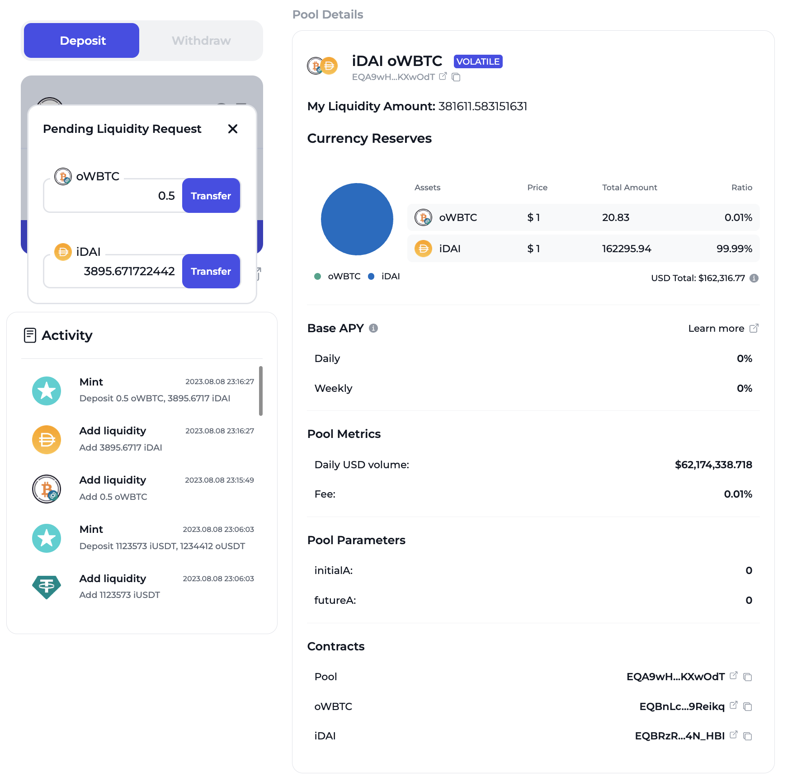
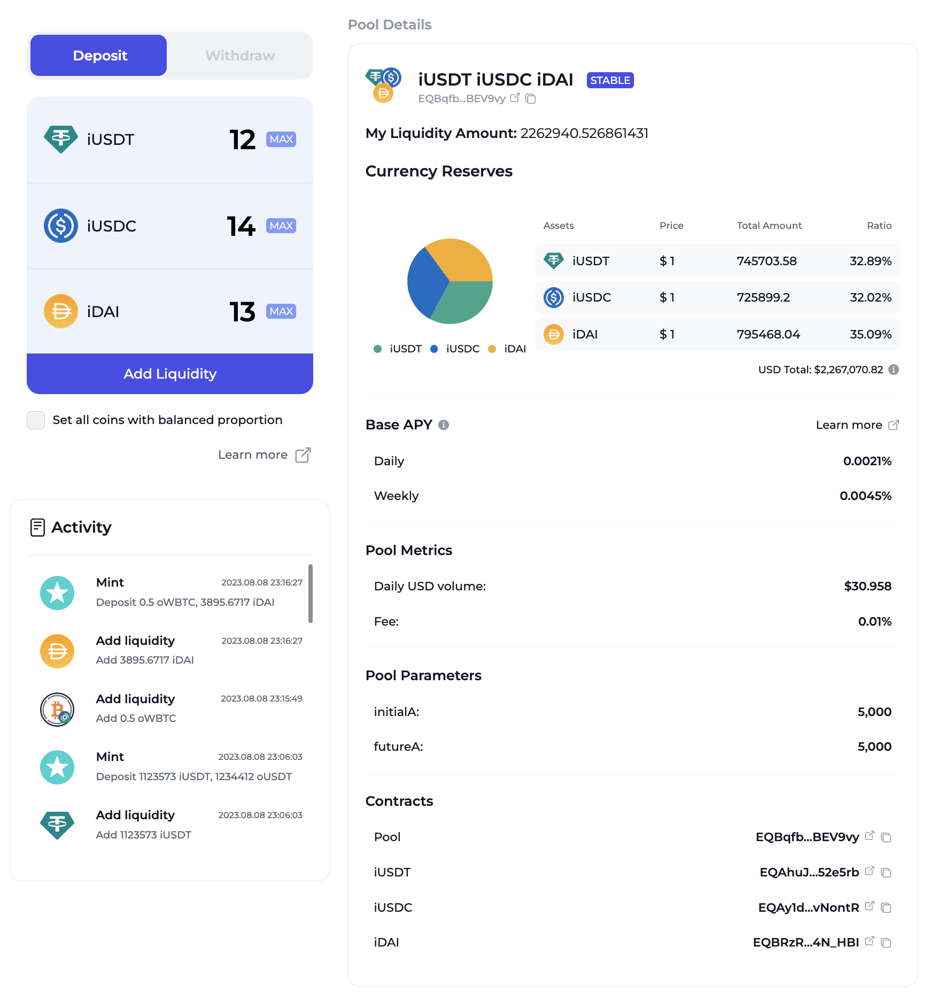
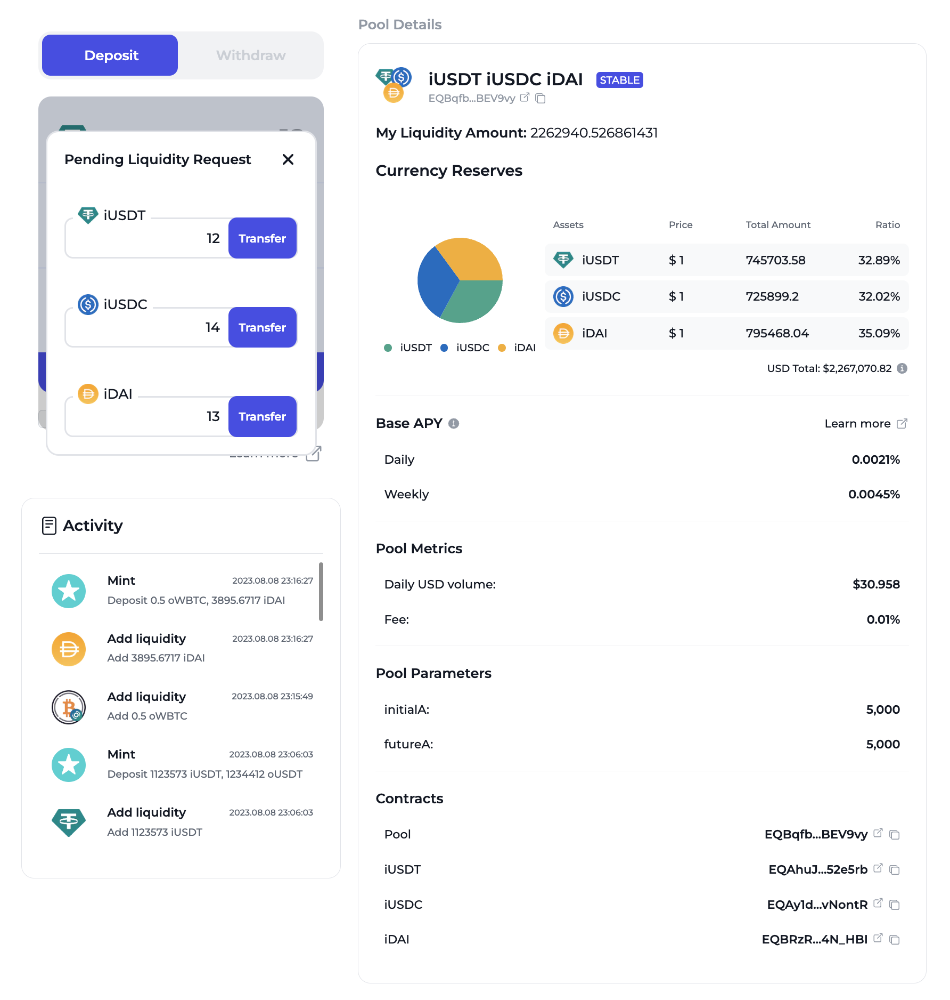

# How to Add Liquidity

### Add Liquidity

Owing to TON’s asynchronous nature, tokens are sent one by one during liquidity provision.

**Select Pool**: Navigate to the Pools page to select your desired pool. Two pool types are available – Volatile and Stable. Each pool requires a unique method for liquidity provision, which can be seen in its respective section.\

<figure><figcaption></figcaption></figure>

### **Volatile Pool**

Liquidity providers must hold both tokens of a pair. Upon inputting one token’s quantity, the system will automatically adjust the other's to maintain the pool's balance ratio.&#x20;

<figure><figcaption></figcaption></figure>

The process entails sending two transactions; the second finalizes the liquidity provision and issues the pool tokens.

<figure><figcaption></figcaption></figure>

### **Stable Pool**

Users can decide how many coins (1-3) they wish to supply. For optimal rates, provide liquidity in proportion to the pool's current balance.&#x20;

<figure><figcaption></figcaption></figure>

For every token you choose to supply, send a respective transaction. Liquidity provision completes with the last transaction.

<figure><figcaption></figcaption></figure>
