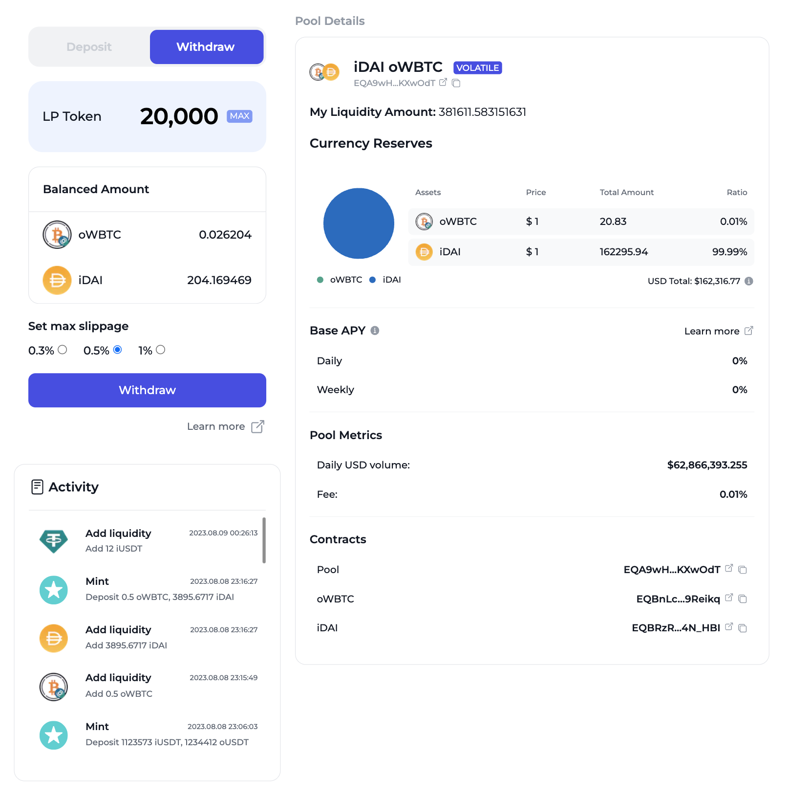
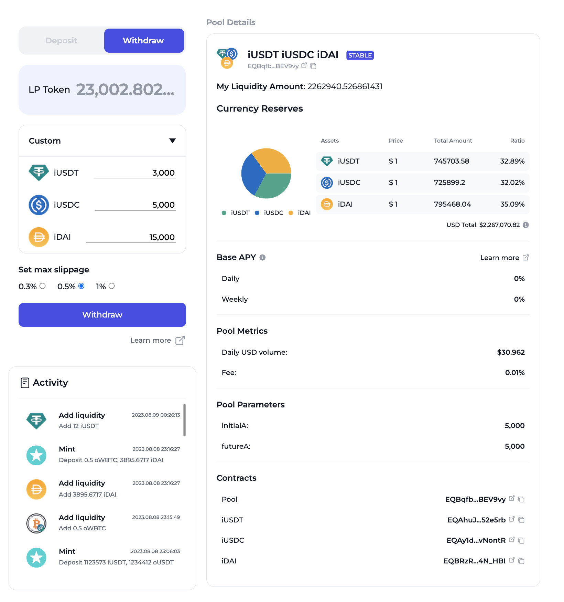
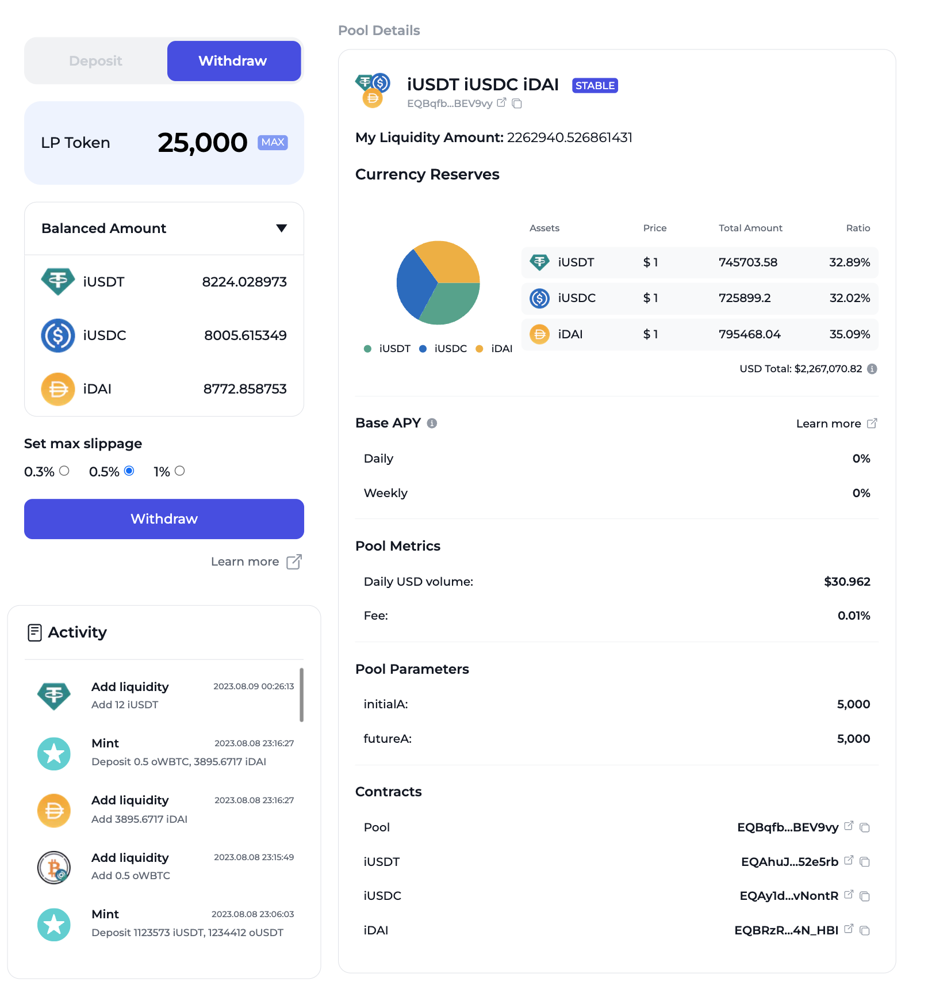

# How to Remove Liquidity

Removing liquidity is a straightforward process for those who've provided liquidity to our pools. By burning your LP tokens, you can reclaim the liquidity you previously added. Do note, the process varies depending on the type of pool.

### Volatile Pool

In a volatile pool, when you decide to remove your liquidity, you will be given back both types of tokens in proportion to the current pool composition.

<figure><figcaption></figcaption></figure>

**Example:**

Imagine you provided liquidity to a TON/USDT volatile pool. Let's say, at the time of removing liquidity, the pool consists of 1000 TON and 20000 USDT. If you decide to burn LP tokens that represent 10% of the pool's liquidity, you would receive:

* 100 TON (10% of 1000 TON) and
* 2000 USDT (10% of 20000 USDT).

### Stable Pool

For stable pools, you have the flexibility to choose how you'd like to reclaim your liquidity.&#x20;

<figure><figcaption></figcaption></figure>

If you decide to remove your liquidity at the current pool rate, there are no fees attached.

<figure><figcaption></figcaption></figure>
