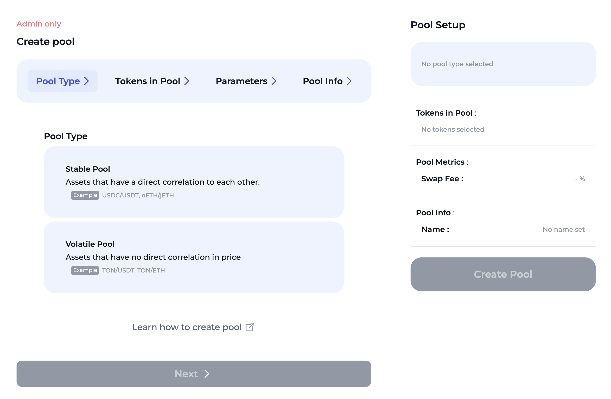
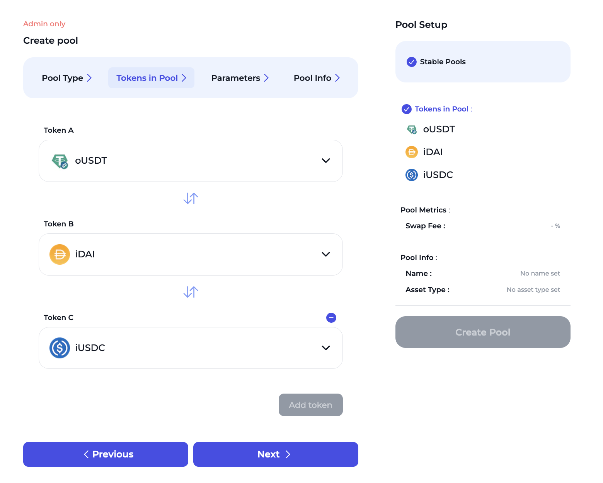
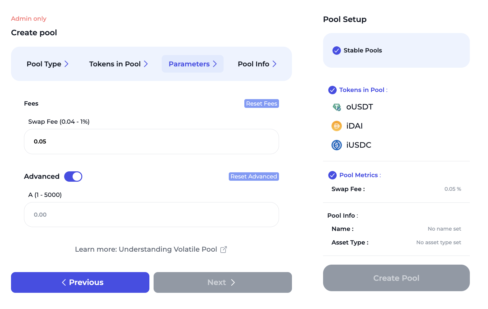
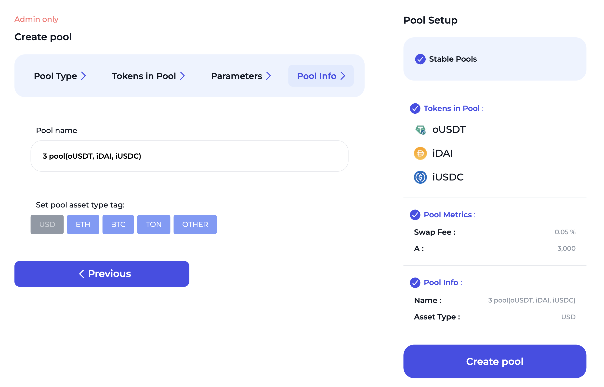

# Create stable pool

Here are the steps on how to create a pool in ION Finance:

1. Click on the "Stable Pool" button.

<figure><figcaption></figcaption></figure>

2. Select the tokens that you want to add to the pool. You can select up to 3 tokens.

<figure><figcaption></figcaption></figure>

3. Set the fee for the pool. Also, you can set `A` value in advanced option.


The `A` value is a parameter that controls the curvature of the exchange rate curve. A higher `A` value means that the curve will be steeper, while a lower `A` value means that the curve will be flatter. This curvature affects how much slippage occurs when users trade on the stable pool


<figure><figcaption></figcaption></figure>

4. Enter the name of the pool and set the pool asset type.

<figure><figcaption></figcaption></figure>

Once you have created the pool, you will be able to add liquidity to it by depositing the tokens that you selected. You will earn fees for providing liquidity to the pool.
