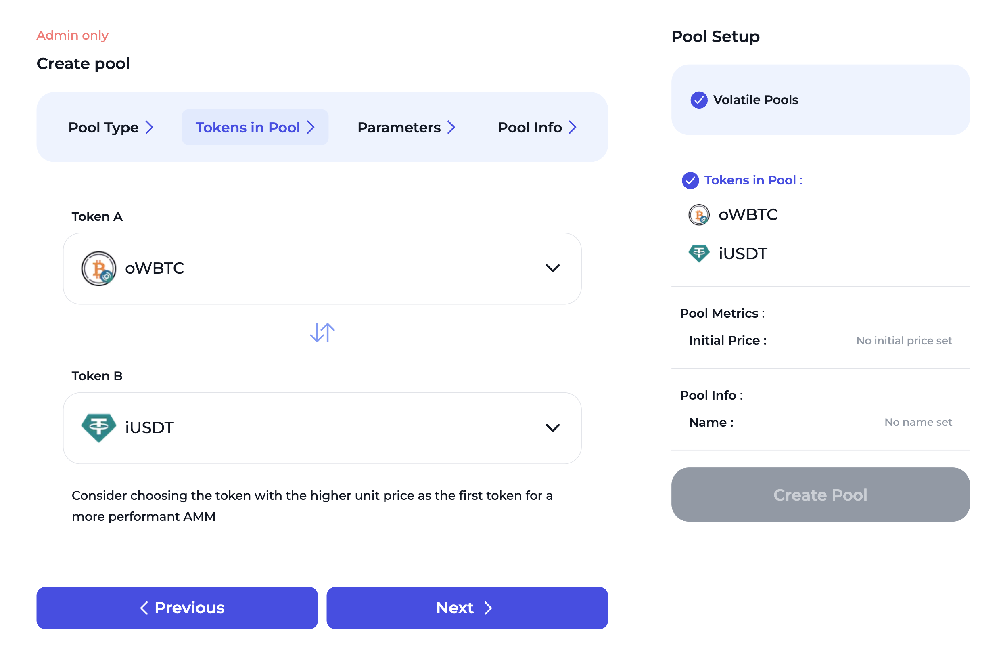
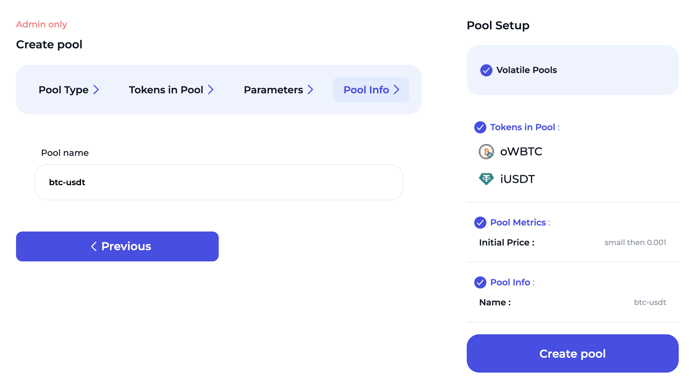

# Create Volatile Pool

Here are the steps on how to create a volatile pool in ION Finance:

1. Click on the "Volatile Pool" button.

<figure><figcaption></figcaption></figure>

2. Select the tokens that you want to add to the pool.

<figure><figcaption></figcaption></figure>

3. Enter the amount of each token that you want to add to the pool. It would determine the initial ratio of each tokens.

<figure><figcaption></figcaption></figure>

4. Enter the name of the pool and click on the "Create pool" button. For every token you choose, send a respective transaction. Pool creation completes with the last transaction.

<figure><figcaption></figcaption></figure>
