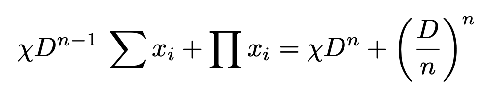

# Roadmap

### **Phase 1: Capital Efficient AMM**

In the first phase of our roadmap, ION Finance will launch two types of pools in Version 1: Stable Pool and Volatile Pool. Users can take advantage of Stable Swap for seamless exchanges of assets with similar price ratios, and Volatile Swap for trading two assets with different prices. Our innovative routing architecture allows for any asset exchange, regardless of direct token pair availability.

<figure><figcaption>
Stable Pool Invariant
</figcaption></figure>

<figure><figcaption>
Volatile Pool Invariant
</figcaption></figure>

### **Phase 2: Zero Slippage Trades with Liquidity Book AMM**

In Version 2, we introduce Liquidity Book AMM, a new structure for asset exchanges with zero slippage. Liquidity providers can concentrate their liquidity in specific zones of their choice, potentially earning higher fees and choosing diverse liquidity provision strategies. TON Blockchain's deterministic addresses and infinitely scalable architecture support this efficient implementation.

### **Phase 3: Customizable Automated Liquidity Manager**

ION Finance will introduce a customizable automated liquidity manager. With this feature, liquidity providers can rest easy, knowing their liquidity is optimized for the best potential returns.
